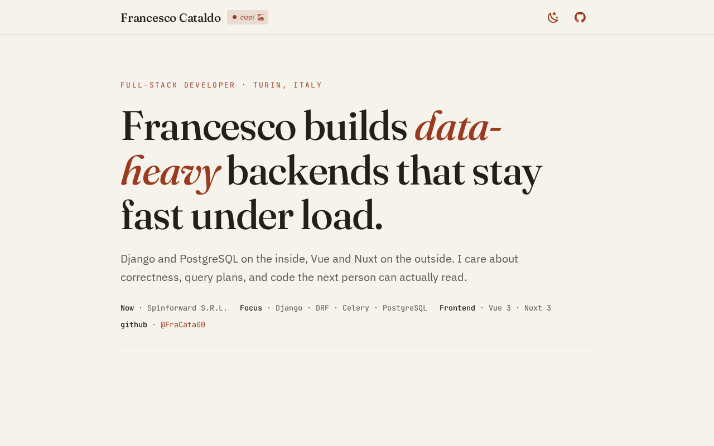
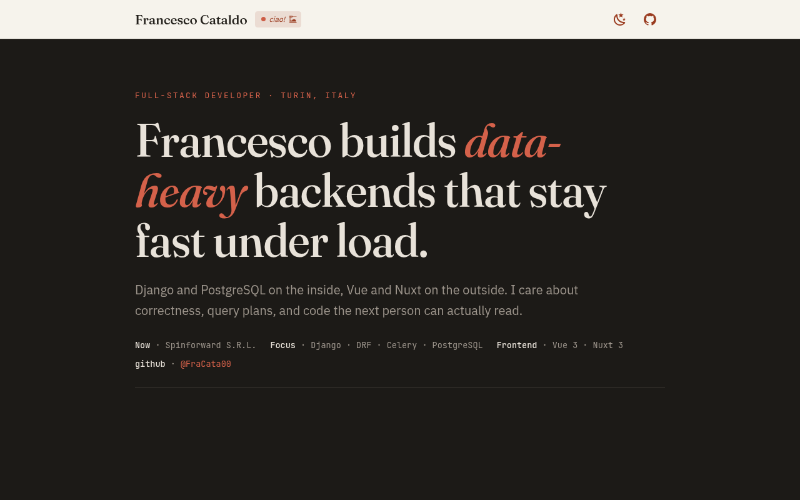

# Portfolio — Francesco

 

Personal engineering portfolio built as a static single-page site with
**Vue 3 + Vuetify 3 + Tailwind CSS**, bundled by **Vite**, and shipped to
**GitHub Pages** via **GitHub Actions**.

## Stack

| Layer        | Choice                                                       |
| ------------ | ------------------------------------------------------------ |
| Framework    | Vue 3 (`<script setup>` SFCs)                                 |
| UI kit       | Vuetify 3 (custom `editorial` theme, MDI icons)              |
| Utilities    | Tailwind CSS 3 (preflight disabled to coexist with Vuetify)  |
| Build        | Vite 5 + `vite-plugin-vuetify` (component auto-import)       |
| Lint         | ESLint 9 (flat config) + `eslint-plugin-vue`                 |
| CI/CD        | GitHub Actions → GitHub Pages                                |

## Project layout

```
src/
├── assets/main.css        # Tailwind layers + theme tokens + shared classes
├── components/            # AppBar, HeroSection, CaseStudies, ToolboxSection,
│                          # OpenSource, ContactFooter
├── data/portfolio.js      # all page content (edit copy here, not in components)
├── directives/reveal.js   # v-reveal: IntersectionObserver fade-in
├── plugins/vuetify.js     # Vuetify instance + editorial theme
├── App.vue
└── main.js
```

## Local development

Requires Node 20+ (see `.nvmrc`).

```bash
npm install
npm run dev        # start the dev server
npm run build      # production build to dist/
npm run preview    # preview the production build
npm run lint       # eslint
```

## Editing content

All copy lives in [`src/data/portfolio.js`](src/data/portfolio.js): hero text,
case studies, toolbox, open-source cards and contacts. Components only render
that data, so updating the site is a content edit, not a code change.


## Deployment

Pushing to `main` triggers `.github/workflows/deploy.yml`, which installs,
lints, builds and publishes `dist/` to GitHub Pages.

One-time setup on GitHub: **Settings → Pages → Build and deployment →
Source: GitHub Actions**.

`vite.config.js` uses `base: './'` (relative asset paths), so the build works
from both a user page (`user.github.io`) and a project page
(`user.github.io/repo/`) without extra configuration.

## License

Content © Francesco. Code released under the MIT License.
